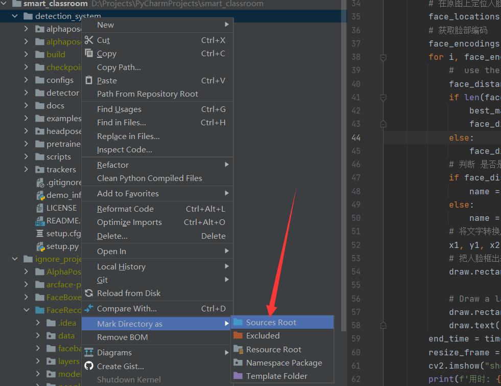

# 智慧教室

课堂专注度及考试作弊系统、课堂动态点名，情绪识别、表情识别和人脸识别结合

## 下载权重

### 1. [Halpe dataset](https://github.com/Fang-Haoshu/Halpe-FullBody) (136 keypoints)

| Model                                                        | Backbone | Detector | Input Size | AP   | Speed       | Download                                                     | Config                                                       | Training Log                                                 |
| ------------------------------------------------------------ | -------- | -------- | ---------- | ---- | ----------- | ------------------------------------------------------------ | ------------------------------------------------------------ | ------------------------------------------------------------ |
| [Fast Pose](https://github.com/MVIG-SJTU/AlphaPose/blob/master/configs/halpe_136/resnet/256x192_res50_lr1e-3_1x.yaml) | ResNet50 | YOLOv3   | 256x192    | 69.0 | 3.54 iter/s | [Google](https://drive.google.com/file/d/17vnGsMDbG4rf50kyj586BVJsiAspQv5v/view?usp=sharing) [Baidu](https://pan.baidu.com/s/1--9DsFjTyQrTMwsMjY7FGg) | [cfg](https://github.com/MVIG-SJTU/AlphaPose/blob/master/configs/halpe_136/resnet/256x192_res50_lr1e-3_2x-regression.yaml) | [log](https://github.com/MVIG-SJTU/AlphaPose/blob/master/docs) |

- 放到detection_system/checkpoints

### 2. Human-ReID based tracking (Recommended)

Currently the best performance tracking model. Paper coming soon.

#### Getting started

Download [human reid model](https://mega.nz/#!YTZFnSJY!wlbo_5oa2TpDAGyWCTKTX1hh4d6DvJhh_RUA2z6i_so) and place it into `AlphaPose/trackers/weights/`.

Then simply run alphapose with additional flag `--pose_track`

You can try different person reid model by modifing `cfg.arch` and `cfg.loadmodel` in `./trackers/tracker_cfg.py`.

If you want to train your own reid model, please refer to this [project](https://github.com/KaiyangZhou/deep-person-reid)

#### Demo

```
./scripts/inference.sh ${CONFIG} ${CHECKPOINT} ${VIDEO_NAME}  ${OUTPUT_DIR}, --pose_track
```

#### Todo

- [] Evaluation Tools for PoseTrack
- [] More Models
- [] Training code for [PoseTrack Dataset](https://posetrack.net/)

### 3. Yolo Detector

Download the object detection model manually: **yolov3-spp.weights**([Google Drive](https://drive.google.com/open?id=1D47msNOOiJKvPOXlnpyzdKA3k6E97NTC) | [Baidu pan](https://pan.baidu.com/s/1Zb2REEIk8tcahDa8KacPNA)). Place it into `detector/yolo/data`.

### 4. face boxes 预训练权重

[google drive](https://drive.google.com/file/d/1tRVwOlu0QtjvADQ2H7vqrRwsWEmaqioI) 

- 放到face_recog/weights文件夹下

## 使用

### 运行setup.py安装必要内容

```shell
python setup.py build develop
```

### 运行demo_inference.py

将detection_system设置为source root



使用摄像头运行程序

```
python demo_inference.py --vis --webcam 0
```

# 参考项目

- [AlphaPose](https://github.com/MVIG-SJTU/AlphaPose) 
- [head-pose-estimation](https://github.com/yinguobing/head-pose-estimation) 
- [faceboxes](https://github.com/zisianw/FaceBoxes.PyTorch) 

# 相关信息

